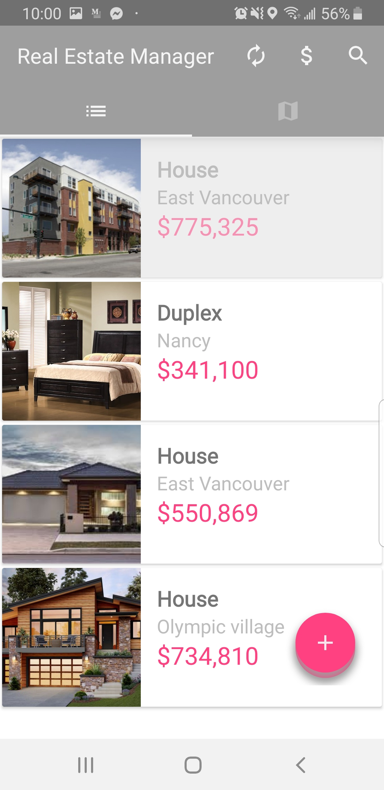
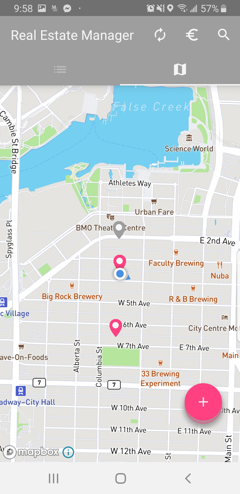
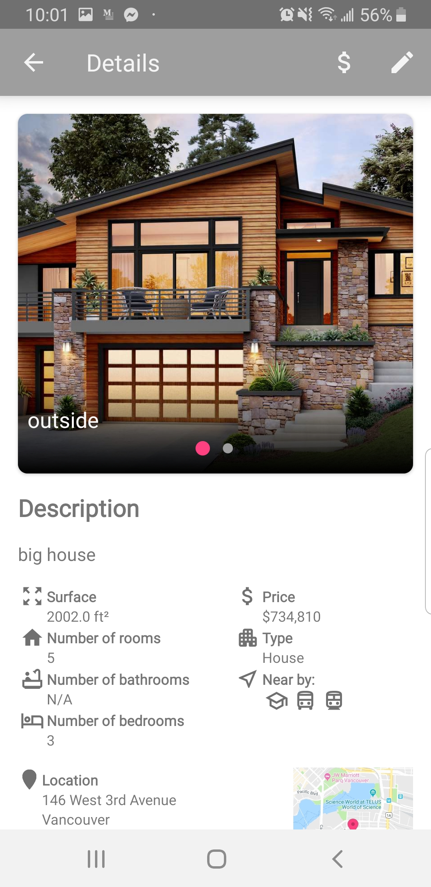
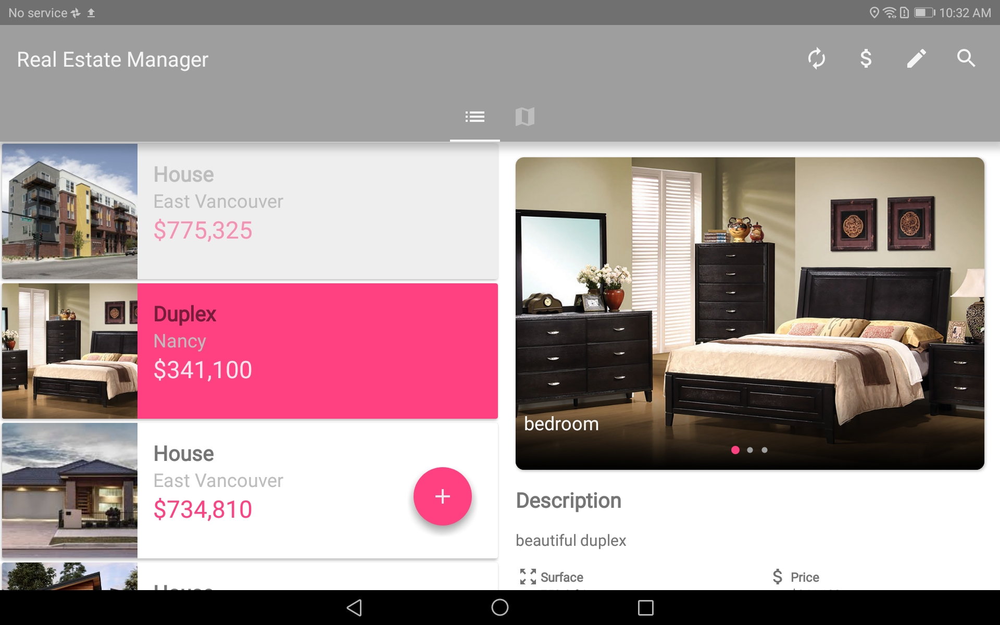
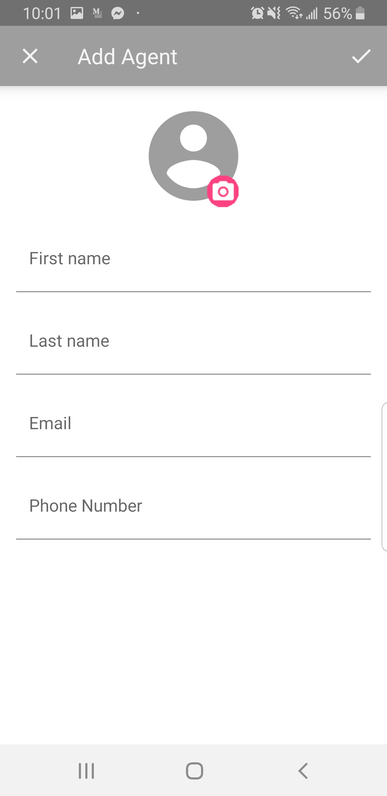

# RealEstateManager
An Android app that allows you to list properties for sale.
All the properties are stored on the device and in the cloud to be shared with all the users.
You can
* visualize all the properties on a map or a list
* modify any property
* add a new property
* add a new agent
* save a draft of a property
* search properties with specific attributes

### Phone display:

&ensp;

### Tablet display:

### Add/Modify Property:

&ensp;

### Search Property:

### Change Currency:

### Add Agent:

## Library
* [Android Support Library](https://developer.android.com/topic/libraries/support-library/)
* [Glide](https://github.com/bumptech/glide/)
* [Gson](https://github.com/google/gson/)
* [ButterKnife](https://jakewharton.github.io/butterknife/)
* [Retrofit](https://square.github.io/retrofit/)
* [RxJava](https://github.com/ReactiveX/RxJava)
* [Cloud Firestore](https://firebase.google.com/docs/firestore)
* [Firebase Authentification](https://firebase.google.com/docs/auth)
* [Cloud Storage](https://firebase.google.com/docs/storage)
* [Room Persistence Library](https://developer.android.com/topic/libraries/architecture/room)
* [Mapbox Android SDK](https://docs.mapbox.com/android/maps/overview/)
* [Smarteist Image Slider](https://github.com/smarteist/Android-Image-Slider)
* [Easy Permissions](https://github.com/googlesamples/easypermissions)
* [Espresso](https://developer.android.com/training/testing/espresso)

## API
* [Google Map geocoding API](https://developers.google.com/maps/documentation/geocoding/intro)

## App Architecture
* MVI
* Kotlin

## Developed By

Galou Minisini

    Copyright 2019 Galou Minisini
